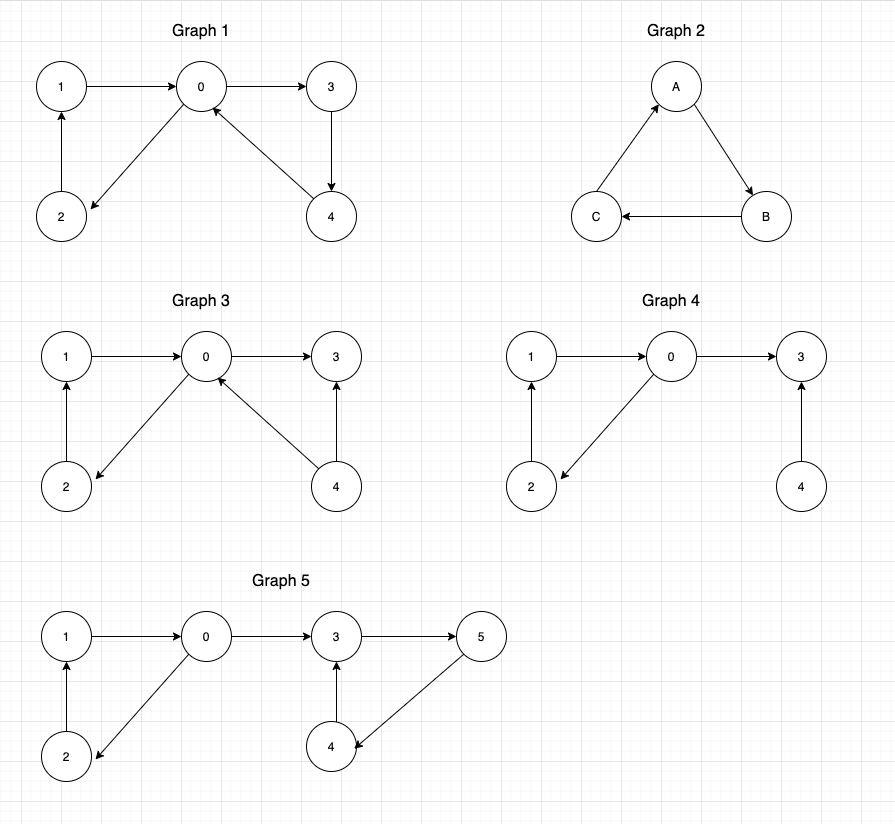
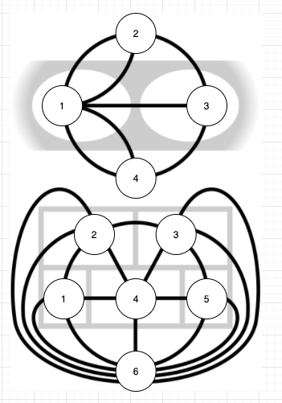

# Topic
This repository is for the javascript implementation for the Eulerian Path/Trail and Eulerian Circuit. For more details about hte Eulerian path, please refer to [Wikipedia](https://en.wikipedia.org/wiki/Eulerian_path)

# Run
Run the command `node eulerianPathCycle.js`
You should see the full output of different test cases including the famous `Server bridges of Koenigsberg` and `Five room puzzle`. 
```
Eulerian Path Test for direct graph 1:  0 -> 2 -> 1 -> 0 -> 3 -> 4 -> 0
...
Eulerian Path Test for direct graph 3:  false
```

If there is a path/cycle for Eulerian Path/Circuit, the `path` will be displayed. Otherwise `false` is displayed.

To extend the test cases, use a simple 2D-array of nodes to represent the graph. For example, `[["1", "2"], ["1", "3"]]`  means there are two edges in the graph, `1 -> 2` and `1 -> 3`. Whether it is directed or undirected edge depends on the function (including *direct* or *undirect* in the name) you invoke.

# Functions
There are four functions implemented:
- Eulerian Path Direct: Convert the input graph into a directed graph and find the Eulerian Path
- Eulerian Path Undirect: Convert the input graph into an undirected graph and find the Eulerian Path
- Eulerian Cycle Direct: Convert the input graph into a directed graph and find the Eulerian circuit/cycle
- Eulerian Cycle Undirect: Convert the input graph into an undirected graph and find the Eulerian circuit/cycle

# Test cases
The first 5 graphs are regular graphs for testing.



The latter two graphs are `Server bridges of Koenigsberg` and `Five room puzzle`. 


